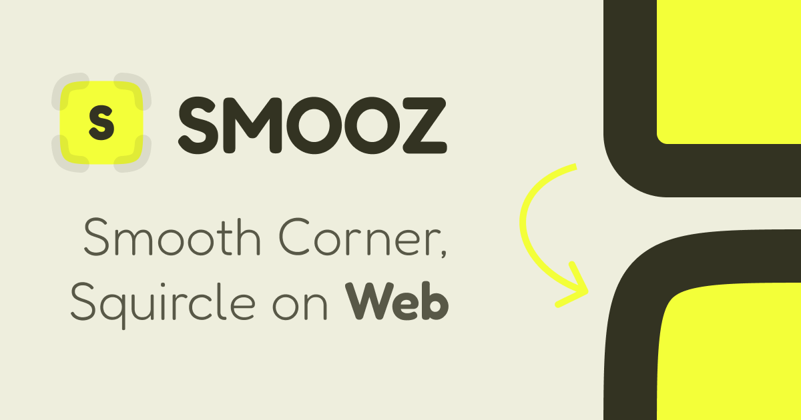

# figma-squircle-wc

English | [日本語](README.ja.md)

TODO

## DEMO Preview 
https://psephopaiktes.github.io/figma-squircle-wc/

## Component
いらんかも。やっぱsvgかdataかみたいreturn属性かな?
- button
- image
- background(image,color,border,shadow,blur)
- form
- clip anything

## つかうイメージ
<svg>が描画される。

<smooz-svg
    fill="#fff"
    width=""
>
    aaa
</smooz-svg>

- button
widthかheightかRは必須にするか・・・
<smooz-base
    fill="#fff"
    radius=""
>
    <button type="submit">Contact</button>
</smooz-base>

- image
<smooz-base
    src="/path/img.jpg"
    radius=""
></smooz-base>

- background(image,color,border,shadow,blur)
- form
- clip anything

## HTMLにSVGもしくはpath直接描画
- 画像として扱える
- HTMLにw0h0で描画しておいてCSSでclip-path: url(#id);(MeBanner)

## CSSにdataURL
- border-image-source: url('data:image/svg+xml,') (Contactボタンに)
- backgroundもいけるかな
